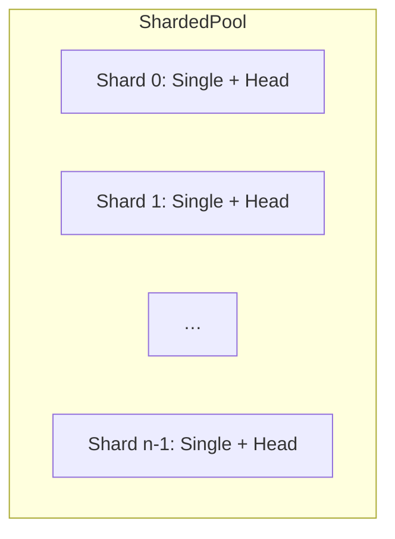
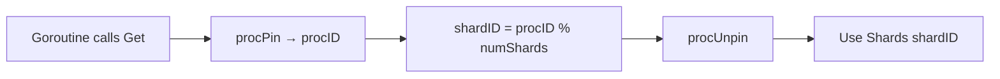
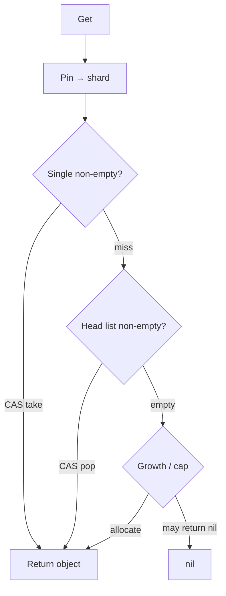
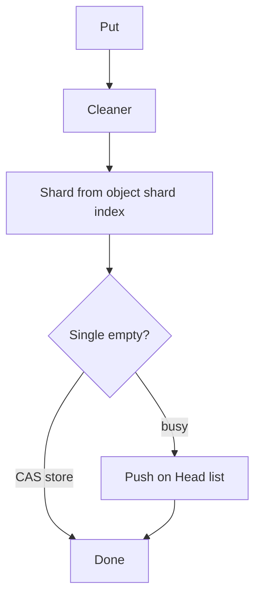

# Minimal Object Pool Design

This object pool uses an atomic singly linked list built from the provided objects themselves to manage the pool efficiently, reducing indirection and allocations. Each object maintains a pointer to the next one using `atomic.Pointer`, allowing lock-free access and updates.

## Sharded layout

The pool is **sharded**: there is one `Shard` per logical CPU by default (`runtime.GOMAXPROCS(0)` at construction, unless `Config.NumShards` overrides it). Each shard holds a **fast single-object slot** (`Single`) and a **lock-free stack** (`Head`) of pooled objects.

## How a goroutine picks a shard

Two runtime hooks are used in `Get` (see `pool.go`):

1. **`runtime.procPin`** — pins the current goroutine to its current P and returns a **processor id**.
2. **`runtime.procUnpin`** — unpins after the shard is chosen.

**Shard index** is `procID % len(Shards)`. That spreads load across shards and improves cache locality versus a single global list.

## Get

On the chosen shard, `Get` tries **`Single`** first (one CAS). If that fails, it pops from the **`Head`** list (compare-and-swap the head pointer). If the lists are empty, it **allocates** via the configured allocator (respecting growth policy when enabled).

## Put

`Put` runs the **Cleaner**, then routes the object to **`Shards[obj.shardIndex]`** (the shard recorded when the object was created or last tied to a shard). It tries to store into **`Single`** first; if that slot is busy, it **pushes** onto the **`Head`** list (with `SetNext` before CAS so readers never see a stale next pointer).

## Why this shape

By storing the `next` pointer inside each object and using atomics on `Single` and `Head`, the pool avoids mutexes on the hot path. Sharding reduces contention when many goroutines call `Get`/`Put` at once. The trade-off is **some** cache locality cost versus array-backed pools, but in **high-contention** workloads the sharded lock-free design usually wins on throughput.

Optional **cleanup** (background eviction by usage) and **growth limits** are layered on top of this core; see [cleanup.md](./cleanup.md) and the `Config` type in code.
